# Application Flow & Architecture Documentation

## Overview
This document explains the overall application architecture, startup process, and request flow for the Learning Platform, including environment configuration, database initialization, and HTTP routing.

## Application Architecture

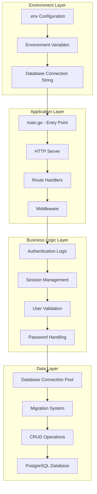

## Application Startup Flow

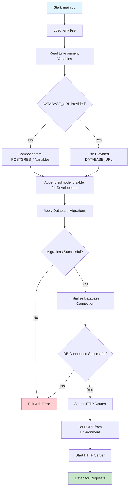

## HTTP Request Flow

### Overall Request Processing
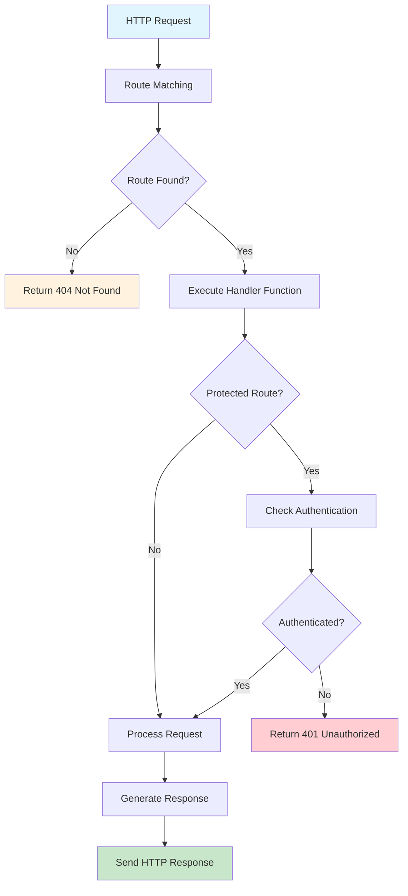

## API Endpoints Flow

### 1. Registration Endpoint Flow
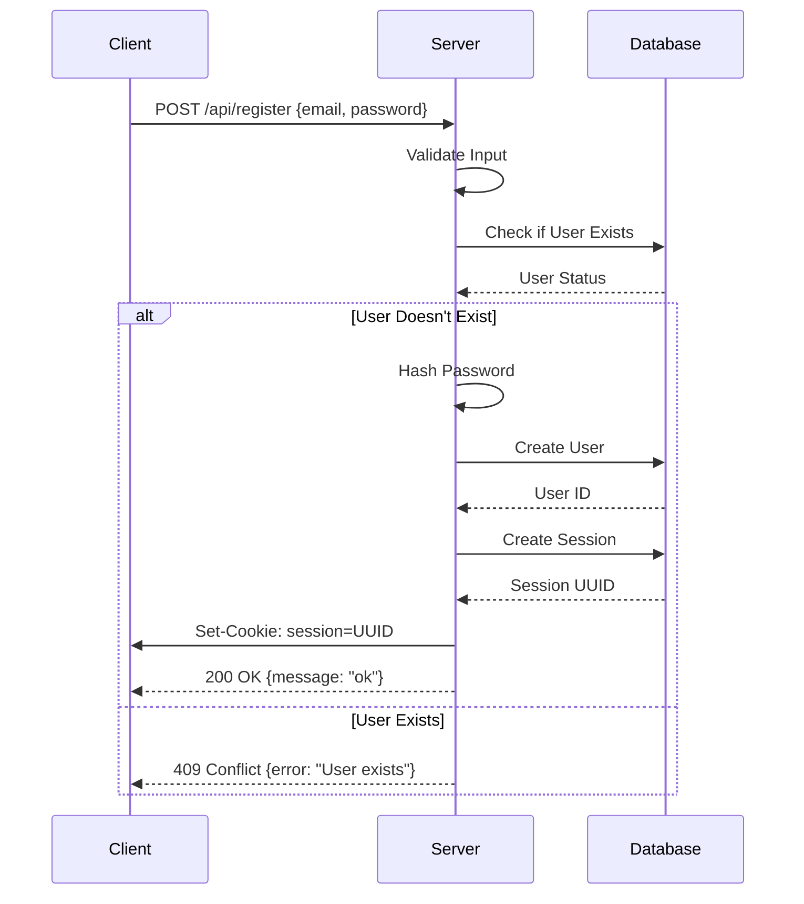

### 2. Login Endpoint Flow
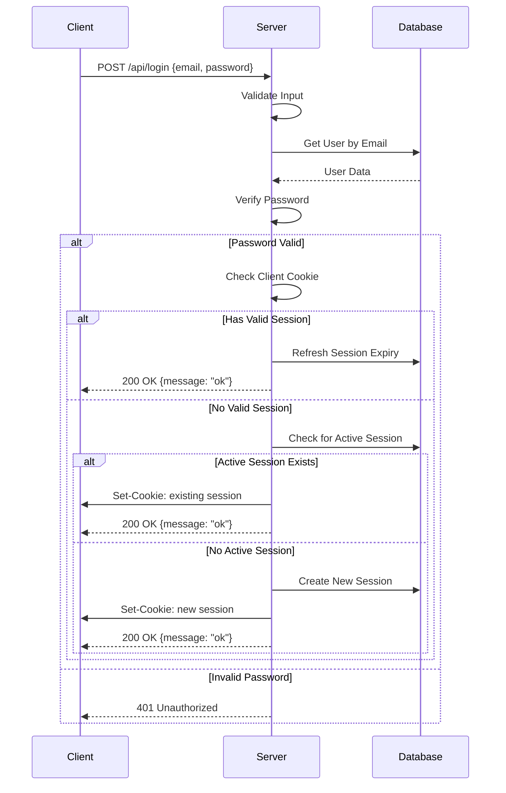

### 3. Protected Route Access Flow
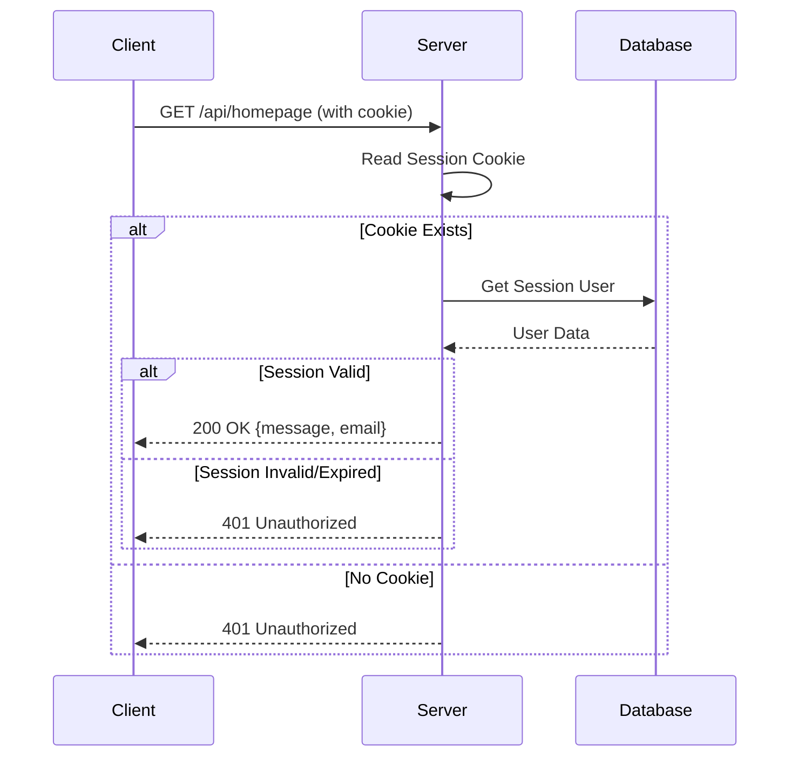

### 4. Logout Flow
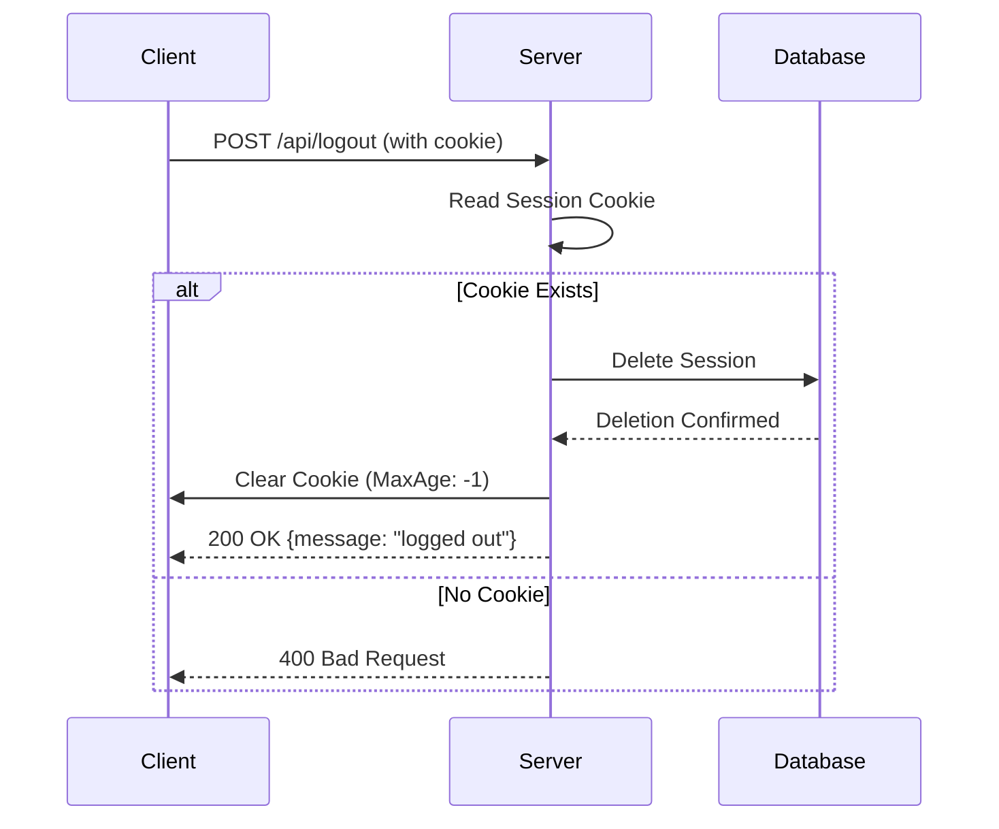

## Environment Configuration Flow

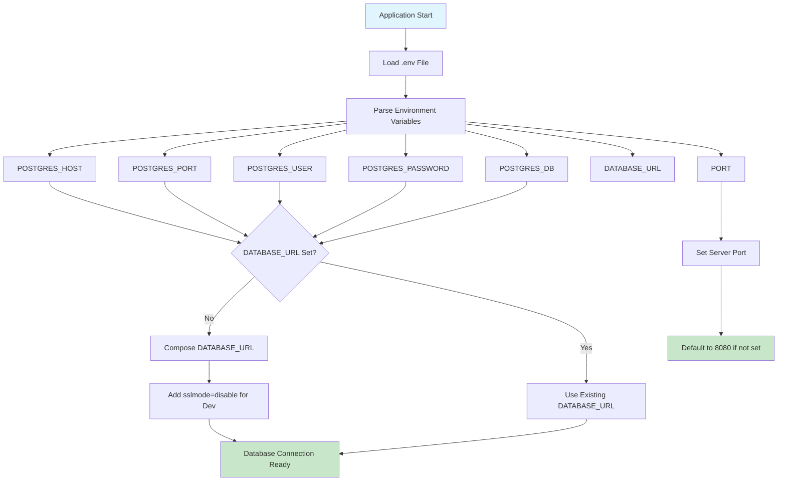

## Database Migration Flow

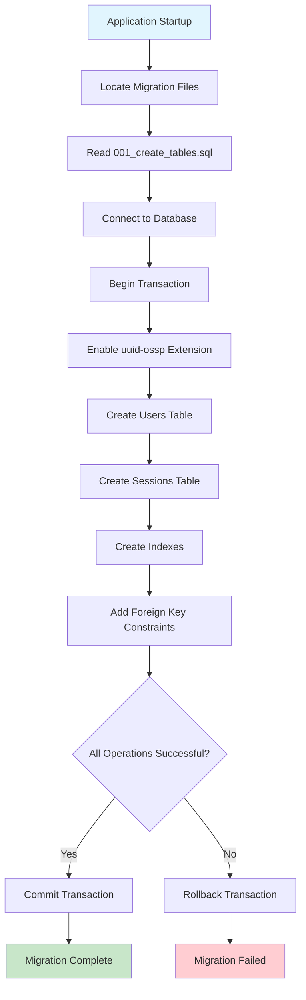

## Session Management Architecture

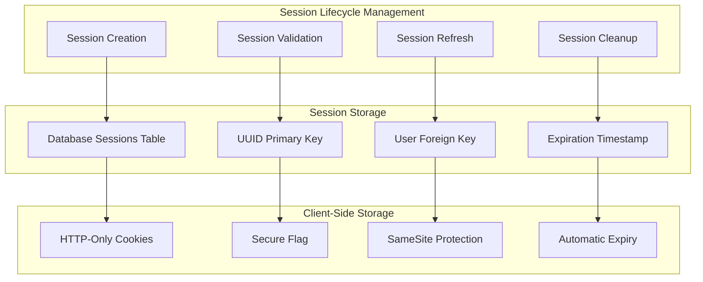

## Error Handling Flow

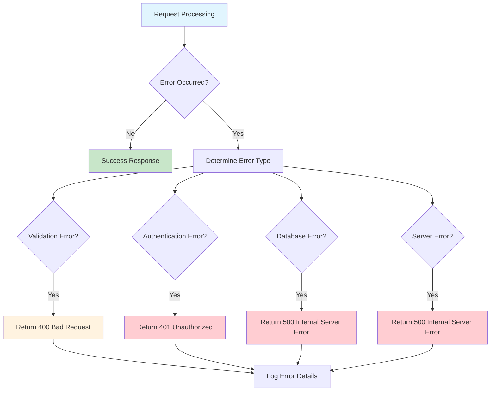

## Production vs Development Configuration

### Development Environment
- `sslmode=disable` for local PostgreSQL
- Relaxed cookie security settings
- Detailed error logging
- Hot reload capabilities

### Production Environment
- SSL/TLS required for database connections
- Secure cookie flags enabled (HttpOnly, Secure, SameSite)
- Error logging without sensitive data exposure
- Environment variable validation

## Performance Considerations

### Database Connection Pooling
- Configurable maximum open connections
- Idle connection management
- Connection lifetime limits
- Automatic connection health checks

### Session Management Optimization
- Efficient session lookup by UUID
- Automatic cleanup of expired sessions
- Minimal database queries per request
- Cookie-based session storage (no server-side memory)