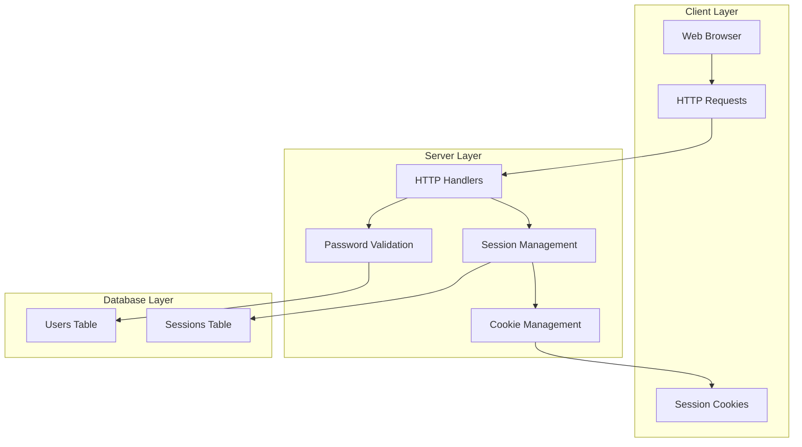
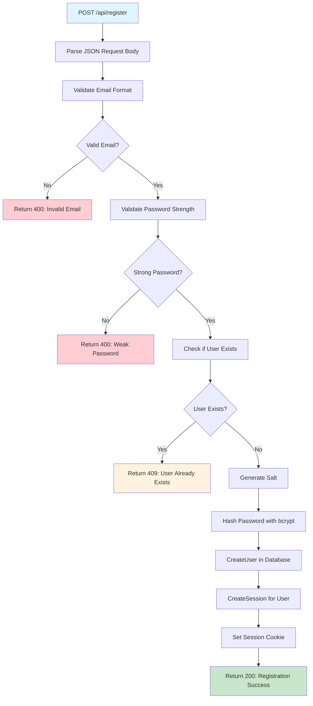
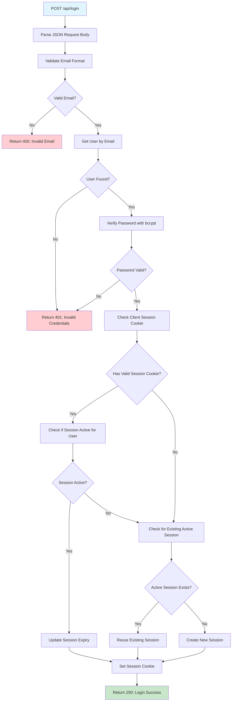
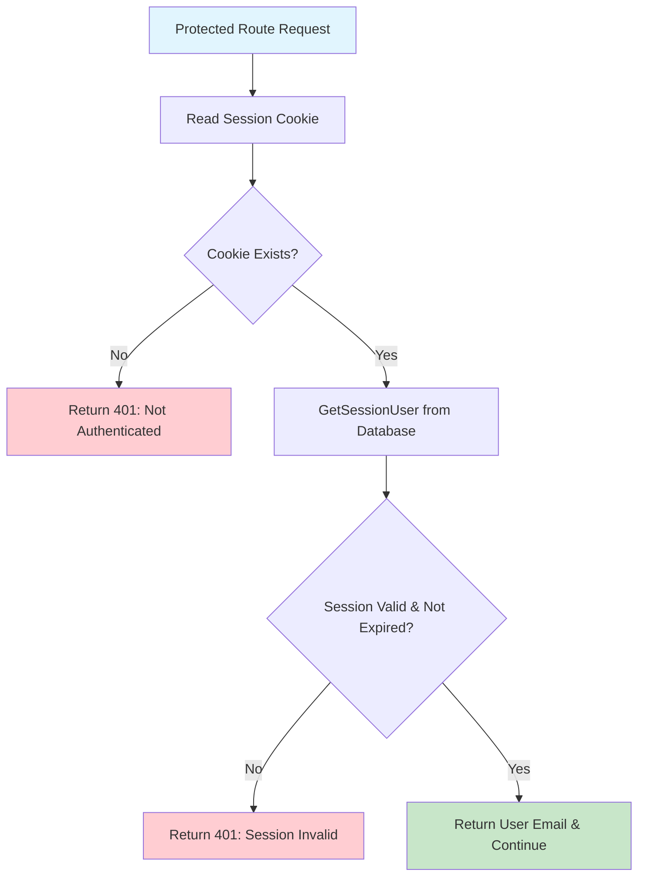
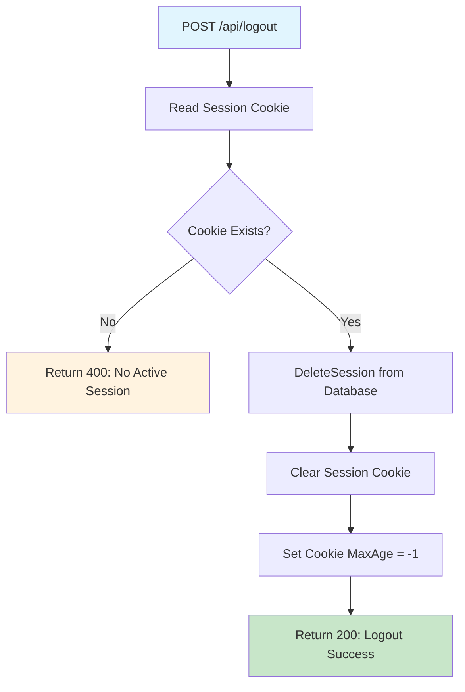
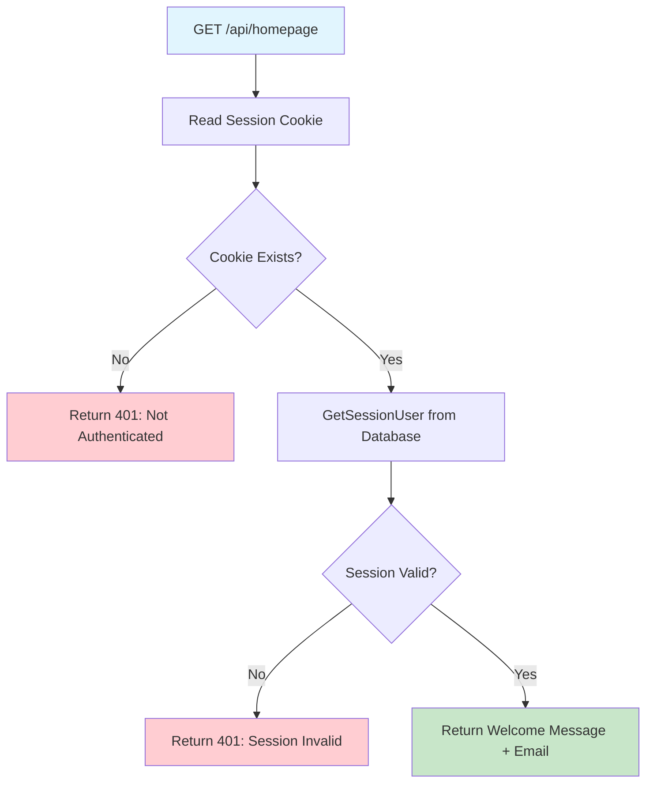
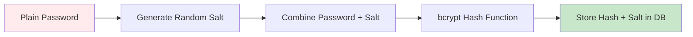
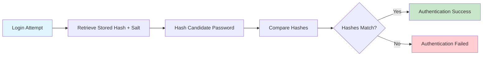
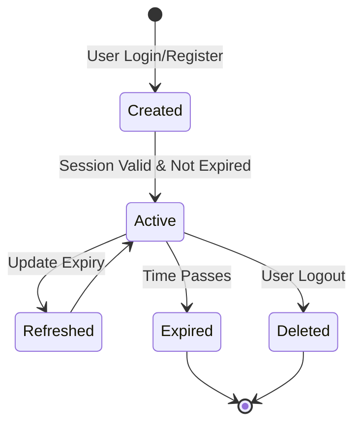
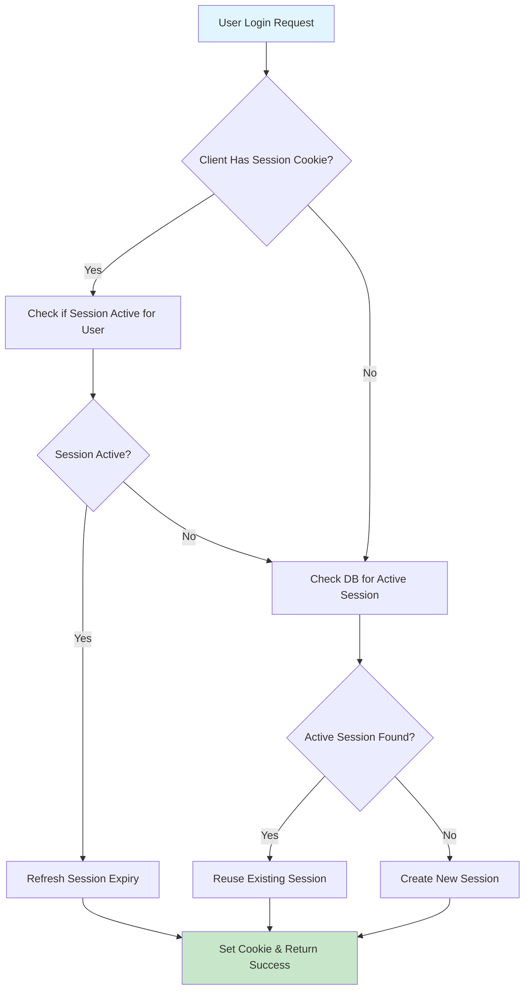

# Authentication System Documentation

## Overview
This document explains the authentication and session management system for the Learning Platform, including user registration, login, logout, and session validation processes.

## Authentication Architecture

## Authentication Flows

### 1. User Registration Flow

### 2. User Login Flow

### 3. Session Validation Flow (CheckAuth)

### 4. User Logout Flow

### 5. Homepage Access Flow

## Password Security

### Password Hashing Process

### Password Verification Process

## Session Management Strategy

### Session Lifecycle

### Session Reuse Logic

## Security Features

### Cookie Security Configuration
- **HttpOnly**: Prevents JavaScript access to cookies
- **Secure**: Ensures cookies only sent over HTTPS in production
- **SameSite**: Protects against CSRF attacks
- **Expiration**: Automatic cleanup of expired sessions

### Authentication Security Measures
1. **bcrypt Password Hashing**: Computationally expensive, salt-based hashing
2. **Session Expiration**: Time-limited sessions prevent indefinite access
3. **Single Active Session**: Prevents session proliferation per user
4. **Secure Cookie Handling**: Production-ready cookie security flags
5. **Input Validation**: Email format and password strength validation

### Validation Rules
- **Email**: Must be valid email format
- **Password**: Minimum strength requirements (length, complexity)
- **Session**: Must exist, belong to user, and not be expired